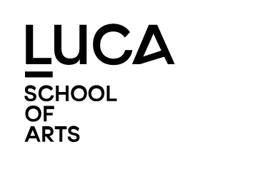

# lerend netwerk: Luca

Meeting 25/04/2022 Luca Gent

<!-- 
1. Hoe wordt kunst en design ingezet in onderzoek?
2. wat betekent kunst in onderzoek? -->

--- 

## topics

1. Polymath lab (?)
2. BabelAR <!--https://docs.google.com/presentation/d/1bUIL82ro1EIso9SZqvoJfxPGN7ETAxMsVLvuQK2gd0I/edit#slide=id.p2 -->
3. TrustVR
4. PWO ondersteuning

---

**@Valery** zouden we polymath vermelden?
Polymath: 
- Kasper & Wouter
- onderzoekslabo en community: brug technologie - creativiteit

**Doel:** hoe future creatives empoweren in functie van opkomende technologiën

---

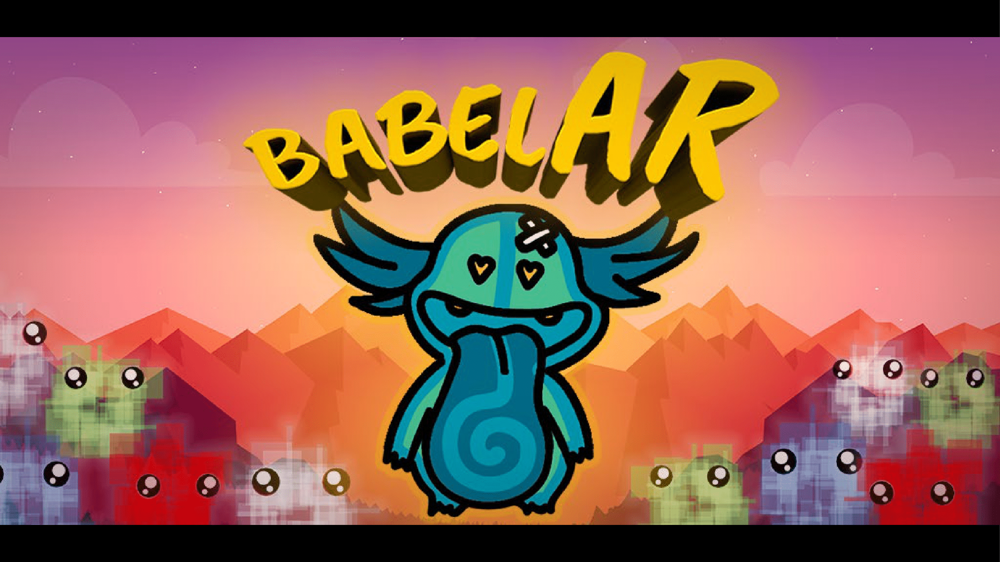

---

## BabelAR

<!-- De Polymath meerwaarde is dat we associatiever kunnen conceptualiseren door artistieke en technologische context -->
<!-- 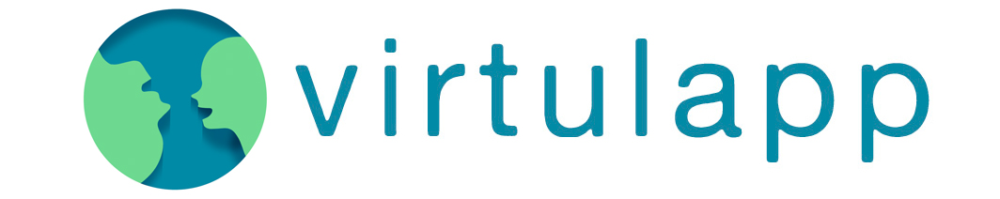 -->
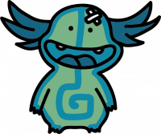

- Erasmus+ project 'virtual language app'
<!-- - oorsprong: noden van leerkrachten bij multilinguale educatie, kennisopbouw van en creeren van tools voor multilinguale educatie: hoe kunnen kinderen zelfstandig collaboratief leren in een multilinguale omgeving, hoe kunnen leerkrachten dit faciliteren en gaan ze hiermee om. -->
- een meertalige, multi-player Augmented Reality game. 
- Henry van de Velde Awards 
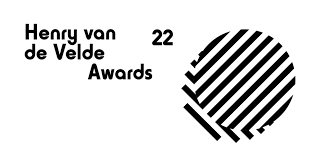
  <!-- - Doel: spelenderwijs kinderen van 7-12 tonen wat de waarde van hun taal/talen is en hoe ze die talenkennis kunnen activeren. 
  - Multilingualiteit hoeft geen hindernis te zijn -->
--- 

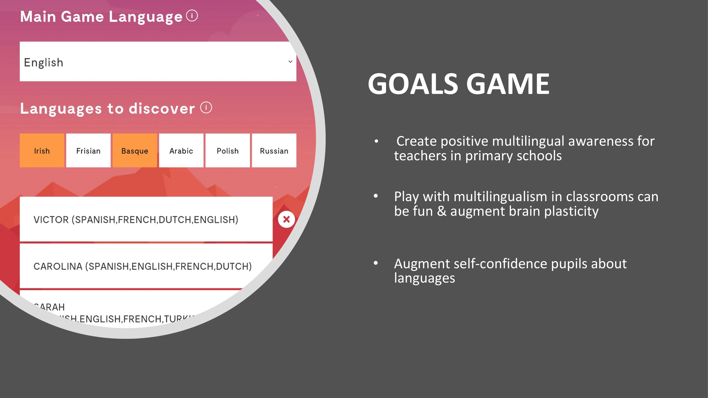

---

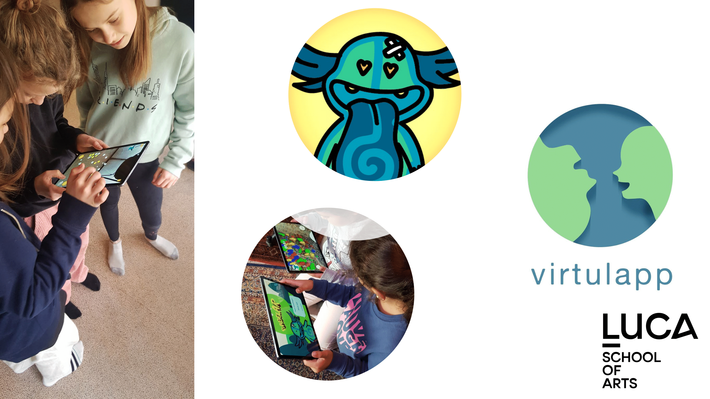

---

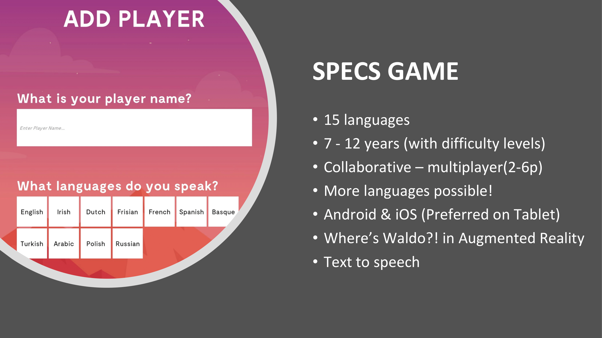

---

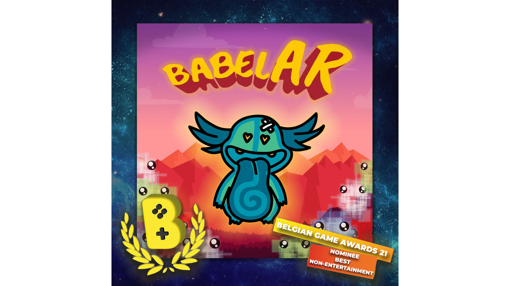

---

[BabelAR film](https://vimeo.com/473359440)

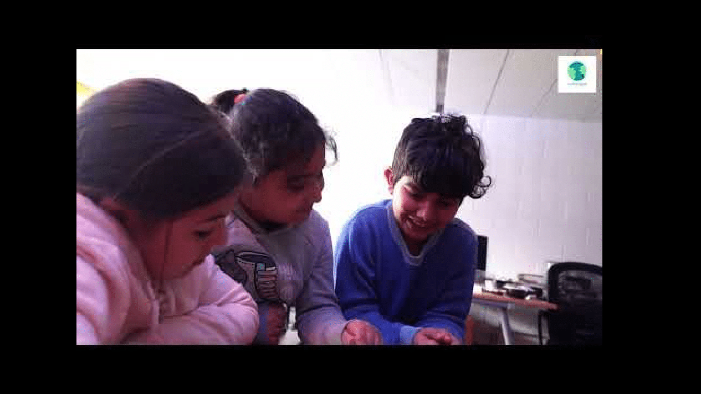

--- 

### Rol van Luca

- idee - concept - realisatie
- visual first aanpak: 
  - interactieve AR omgeving
  - game-ontwikkeling ism research:
  <!-- - creatieve aanpak voor betrokkenheid van de kinderen
  - iteratief proces: in samenwerking met zowel de kinderen, leerkrachten als onderzoekers.  -->
- game: groot bereik
  - meer feedback 
  - impact & gekendheid
<!-- - geheel mogelijk door link artistieke en technologische context -->

--- 

## TrustVR

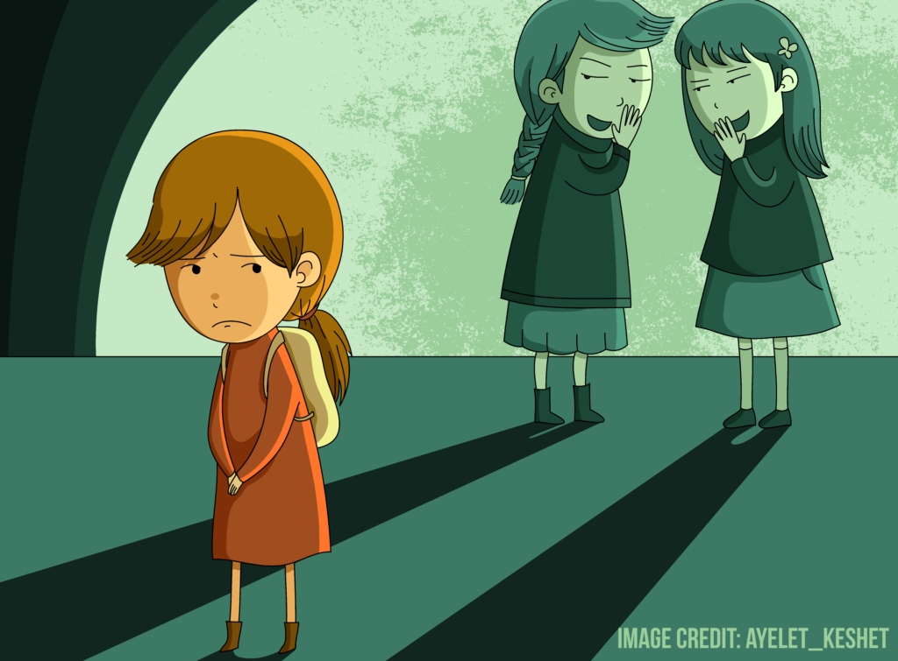

- samenwerking KULeuven Psychologie en Luca
- hechtingsproblematiek bij kinderen (9-12)
  - invloed van Oxytocine op hechting?

---

### doel

immersieve opstelling :
  - VR-omgeving
  - data-captatie: 
    - EEG, GSR, eye-tracking, questionnaires
  - rollenspel: Cyberball

---

### Rol van luca

- ontwikkeling spelomgeving + integratie sensoren
- user story uitschrijven in functie van onderzoek KUL
- samen kijken met KUL voor meerwaarde dmv Virtual Reality
  - game development
  - 3D modelling voor de 'suspension of disbelief'
  - design process

---

### PWO ondersteuning

- domein- + technische experts
- bv Narafi 

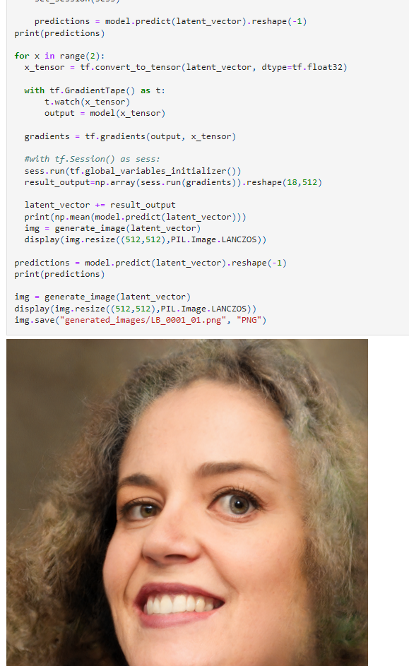

