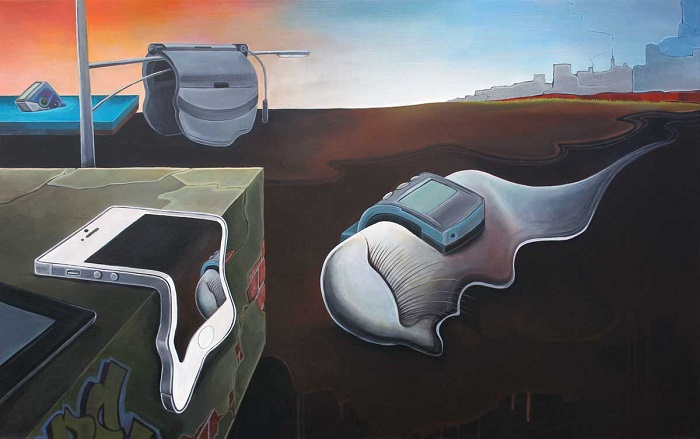
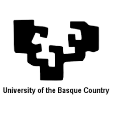
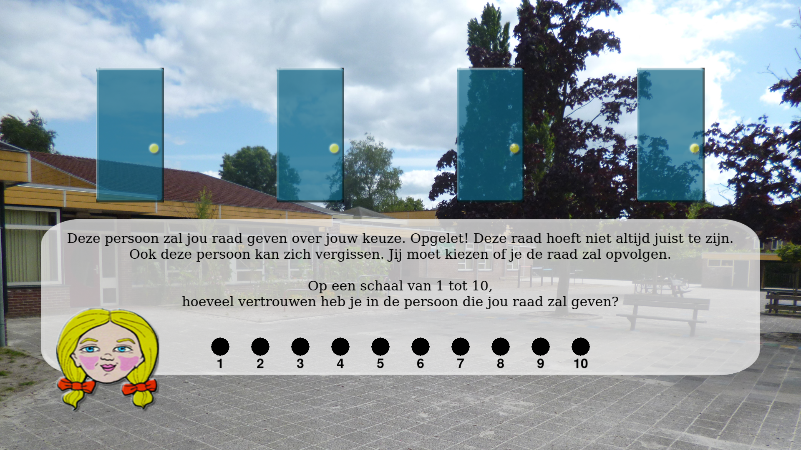
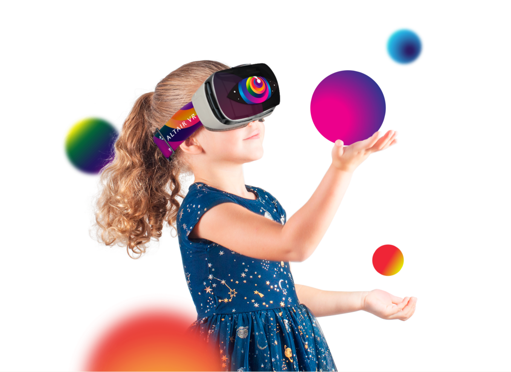

# lerend netwerk Arts-Based Research

## LUCA

Meeting 25/04/2022 LUCA Gent

<!-- 
  1. Hoe wordt kunst en design ingezet in onderzoek?
  2. wat betekent kunst in onderzoek? 
  3. art based research netwerk binnen praktijkgebaseerd onderzoek, waarom komen ze tot bij ons om creatieve kunst in te zetten in research: creative and artistic skills. 
  4. immersieve omgeving als extra voor geloofwaardigheid, storytelling, ...
  5. De game-omgeving en creative storytelling approach 
-->

--- 

## topics

1. Polymath lab
2. BabelAR <!--https://docs.google.com/presentation/d/1bUIL82ro1EIso9SZqvoJfxPGN7ETAxMsVLvuQK2gd0I/edit#slide=id.p2 -->
3. TrustVR

---

<!-- wie ben ik -->
## wouter

ingenieur elektronica + leerkracht
<!-- Ik heb enkele jobs achter de rug maar ik ga het kort houden: -->
imec: 
- fundamenteel research
- burgerparticipatie projecten
- elektronica - software - AI 
- fysieke prototypes

LUCA: tech & creativity
<!-- Ik vind het belangrijk om de brug te kunnen leggen tussen technologie en de wereld erbuiten. Creatievelingen denken continu na over waar ze willen voor staan en hoe dit vorm te geven. Dat is een prachtige omgeving om in te springen en te kijken hoe de beide werelden in interactie kunnen staan. -->

<3 muziek

--- 

<!-- Een project binnen imec waar mooi technologie en creativiteit samenkwam met mijn passie muziek was een project dat we opgestart hadden met de muziekgroep STUFF. -->

---

<!-- https://henryvandevelde.be/nl/awards/22/babelar -->

<!-- We gaan beginnen met BabelAR als project, waarin een game ontwikkelt werd rond taal- en cultuurbewustzijn. Laten we even starten met een video-->

---

[BabelAR film](https://vimeo.com/473359440)

---

<!-- BabelAR is een multilinguïstisch puzzelavontuur in AR (zaken toevoegen aan realiteit). Het is ontwikkeld als onderdeel van de toolkit Virtulapp. Binnen virtulapp werden innovatieve oplossingen bekeken voor klassen met multilinguale kinderen. -->

--- 

<!-- 
Kinderen moeten samenwerken in kleine groepen om een gemeenschappelijk doel te bereiken, namelijk het monstertje BabelAR terug naar huis krijgen. De betrokkenheid van de kinderen met de spelwereld is groot door te kiezen voor AR als medium en een wereld te creeren voor hun. Kinderen spelen sowieso al met soldaatjes of barbiepoppen om enkele stereotiepen te zeggen in de dagdagelijkse omgeving. -->

---

<!-- 
Er zitten dus meerdere talen in het spel en het doel is juist door de samenwerking op een positieve manier andere talen en culturen én de meertalige noden van kinderen in klaslokalen te introduceren. -->

---

<!-- Het spel heeft dan ook de Henry Vandevelde award gewonnen, net als enkele nominaties. Dus een prijs voor een design dat een positieve impact heeft op de samenleving! -->

--- 

# consortium virtulapp 

> PWO LUCA: CoHack Reality

<!-- https://virtulapp.eu/project/partners/ -->

- Fryske Akademy
  - Mercator European Research Centre
- ATiT
- Trinity College Dublin
- University of the Basque Country
- LUCA School of Arts

---

### Rol van LUCA - inzet arts-based research

- idee - concept - realisatie
  - visual first: 
    - leefwereld van doelpubliek!
      - interactieve AR omgeving
        - idee 
        - bedenken van game mechanismes
        - vormgeving: zowel 2D als 3D
  - in samenwerking met consortium:
    - domeinexpertise!
- game: groot bereik
  - meer gebruikersfeedback 
  - impact & gekendheid

<!-- Tweeledige doelstelling: aangenaam zijn voor doelpubliek en de onderzoeksdoelstellingen bedienen -->

<!-- game omgeving dankbare omgeving voor research -->
<!-- - creatieve aanpak voor betrokkenheid van de kinderen
  - iteratief proces: in samenwerking met zowel de kinderen, leerkrachten als onderzoekers.  -->
<!-- - geheel mogelijk door link artistieke en technologische context -->

--- 

## TrustVR 

> (working title)

- samenwerking KULeuven Psychologie en LUCA
- hechtingsproblematiek bij kinderen (9-12)

<!-- Basisvertrekpunt: Vertrouwen ontwikkelt zich als een verwachtings-leerproces , gelinkt aan het al dan niet succesvol zijn van de nodige hulp. Er is een duidelijk verschil in het vertrouwen van mensen en hoe ze steun gaan zoeken. Het vermoeden is dat een bepaalde stof, oxytocine, van groot invloed kan zijn op de vertrouwensontwikkeling.  -->

---

<!-- 
In het verleden heeft de KUL omtrent deze problematiek reeds meerdere onderzoeken gedaan, dit is een voorbeeld ervan waarbij kinderen dienen te raden achter welke schooldeur hun vriendjes zich bevinden. Echter als ze verkeerd raden, zitten er pesters of de 'saaie' kinderen achter de deur. Iedere trial kunnen ze hulp inroepen van hun vertrouwenspersoon en die geeft dan ofwel goede ofwel slechte raad. 
Nu werden er al duidelijk elementen toegevoegd om het geheel de leefwereld van een leerling te laten benaderen, zoals de achtergrond, maar er is ruimte voor verbetering.  -->

---

### Doel

immersieve opstelling :
  - VR-omgeving
  - biosensing (EEG, eye-tracking, GSR)
  - speelwereld waarin emotionele stress geinduceerd wordt met ondersteuning van een zorgfiguur.

---

### Rol van LUCA

Dankbaar standpunt: ruim en toch duidelijke onderzoeksvraag.
<!-- De ontwikkeling van de spelomgeving en het hele spelconcept is iets waar je je creatief in kunt laten gaan, en waarvan je weet dat ieder element een meerwaarde moet en kan hebben. Het doel is niet zozeer iets zo realistisch mogelijk te maken, wel zo geloofwaardig mogelijk. De suspension of disbelief: je kijkt naar een fictiefilm waarvan je weet dat het niet kan gebeuren en toch ga je er in op (horrorfilms!) -->

- user story: cyberball
    1. uitsluiting
    2. competitie
    3. combinatie
- ontwikkeling spelomgeving + integratie sensoren
- samen kijken met KUL voor meerwaarde dmv Virtual Reality
  - game development
  - 3D modelling voor de 'suspension of disbelief'
  - design process

---

# vragen?