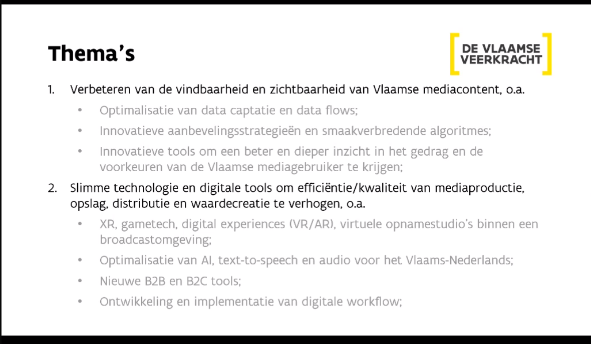
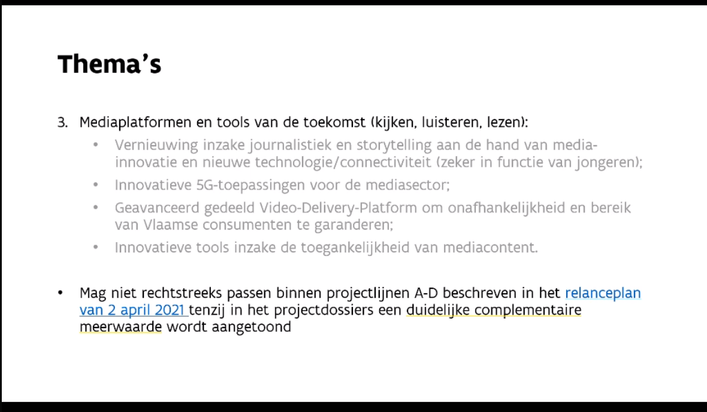
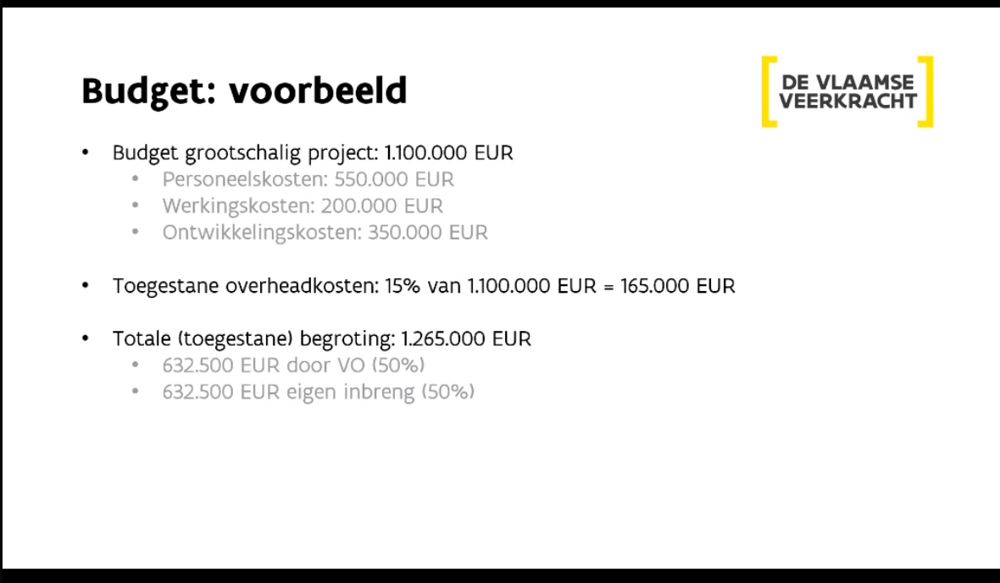
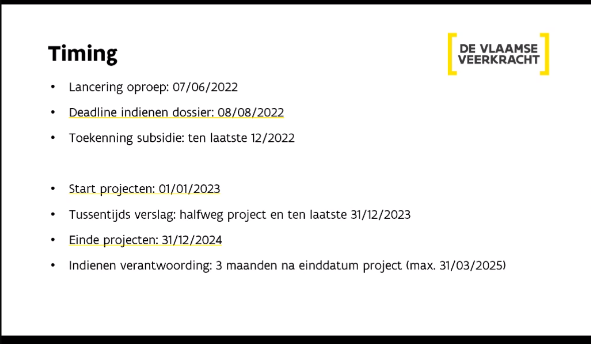
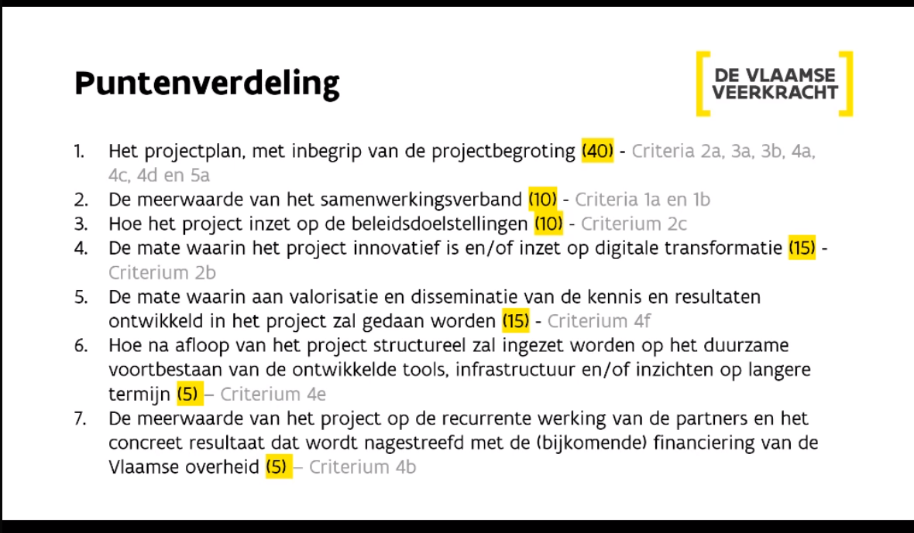

emma vandevelde ==> dept cultuur jeugd media, focus media

ontwikkelingsprojecten met kort implementatietraject (2-3 jaar)

doelgroep oa Onderzoeksgroepen media

nieuwe innovatieve tools/diensten.

thema's:
1. verbeteren vindbaarheid/zichtbaarheid vlaamse mediacontent
2. slimme tech en dig tools om efficiëntie/kwaliteit mediaproductie, opslag, distributie en waardecreatie te verhogen
3. mediaplatformen en tools van de toekomst (kijken, luisteren, lezen)

budget: 

klein: 150.000 - 499.999 ==> 75% financiering overheid : totaalbudget 3.000.000
groot: 500.000 - 1.500.500 ==> 50% financiering overheid: totaalbudget 8.000.000

personeelskosten, werkingskosten, ontwikkelingskosten
overhead max 15%

**opletten**: enkel eerste versie indiening telt in het systeem!

Voelt de vlaamse mediagebruiker een meerwaarde door dit project?

vragen: oproepenmedia@vlaanderen.be

jury: nog niet vastgelegd

budget van projecten verkleinen wordt niet geprefereerd, eerder wordt het aantal goedgekeurde projecten verkleind;

**geen** mondeling contact tussen jury en aanvragers, alles gebeurd obv indieningsdoc

hopen op 7-8 kleinschalige projecten
richten op 10 of iets meer grootschalige projecten

artistieke residentieformaat in hogeschool ==> microlearningformaat  ==> 

data-art award stad gent: kan gent een speler worden obv data-arts award

ritcs? ==> research AI / audiovisual
artevelde/hogent ==> AI opleiding?
opleiding audiovisueel AI integreren? in een lab?

crew ==> AI call sentiant being

inthepocket?
nog spelers?hogent

STARTS toolkit: ideale residentieformat? gelinkt aan wat ik nu doe?
iedere residentie ander samenwerkingsverband

is data + AI de formule waarin we ons willen presenteren?
deepfake video kan onderdeel zijn maar geen umbrella

oproep kuleuven infrastructuur

doel: one-pager, kleinschalig project
bedrijven?
onderzoekers?

