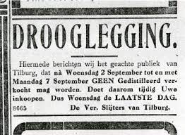
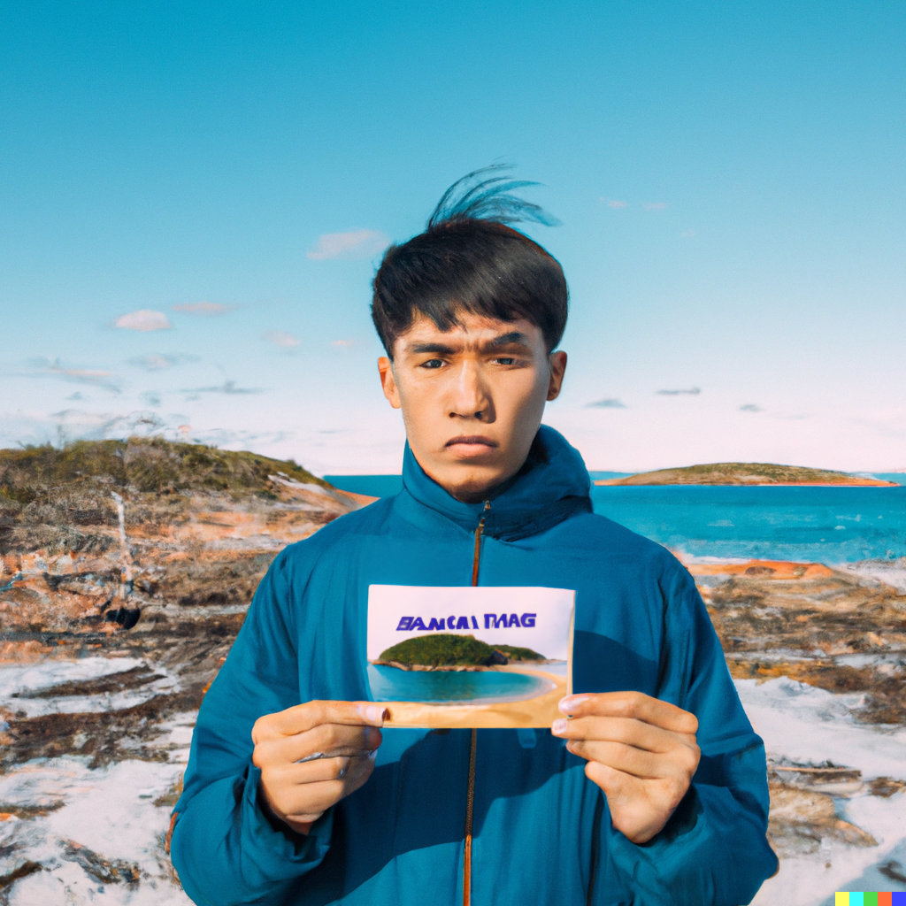
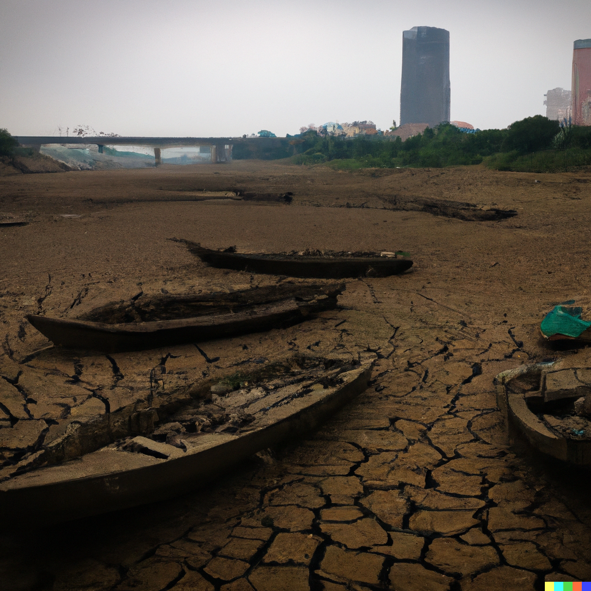

# Drought

0789570003

droogte, waterschaarste, het is een (pun intended) hot topic.

Ofwel is er water teveel (Wallonië) om te verwerken, ofwel staat Vlaanderen droog.
Het gebruik van water, door individuen en door bedrijven willen we aankaarten.

In het drooglegging project worden de watertekorten en overschotten in kaart gebracht.
Om mensen bewust te maken van de invloed van hun gedrag en keuzes op het teveel/tekort aan water bij hun, staat LUCA in voor het dissemineren van de onderzoeksresultaten en bewustvorming bij het belgische publiek.
We willen *niet* mensen op de vingers tikken, maar wel ervoor zorgen dat zoveel mogelijk mensen zich bewust zijn van hun invloed op water.
LUCA polymath maakt gebruik van nieuwe technologieën om de storytelling te ondersteunen en de impact te vergroten op het doelpubliek.
Zo genereren we (middels AI) utopische en dystopische beelden van mensen hun eigen omgeving om het publiek bewust te maken,  maken we affiches van populaire vliegbestemmingen die afzien door het veranderende klimaat. 
We genereren unieke varianten van hetzelfde verhaal door middel van AI.
Studio Reclame denkt mee na, in samenwerking met AI,  over slogans die aansluiten bij verschillende personas (denk de vlaming wiens grasperk perfect groen blijft bij een hittegolf, tot de stedeling die massa's advocado's eet, tot de impact van het bedrijf een beetje verderop).

